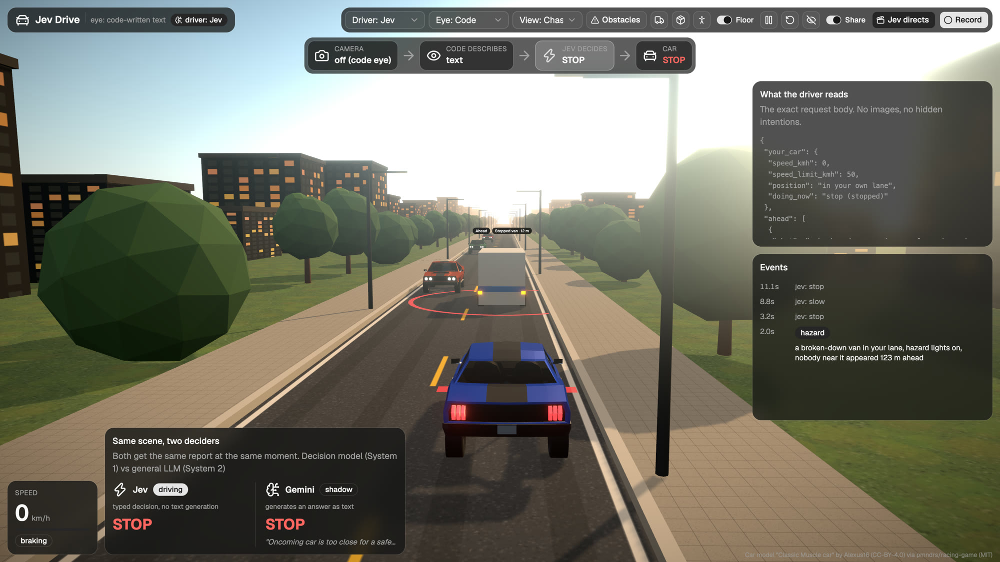

# Jev Drive

**The model driving this car never sees the road.** It reads a short paragraph about it, twice a second, and picks one of four manoeuvres.

Jev Drive is an experiment, not a driving system. It is a 3D simulator where the car is driven by [Jev](https://typesafe.ai), TypeSafe's decision model. Obstacles appear on the road, some of them suddenly. Something has to turn the scene into words, Jev chooses what the car does, and code does the rest: it carries out the choice and slams the brakes when nothing else will do.



The project exists to make one question easy to watch and easy to test: **when a model does not see the world itself, how much of a good decision comes from the model, and how much from whoever describes the world to it?** The eye can be swapped (the simulator's own perfect description, or a vision model looking at the rendered frame), and so can the driver (Jev, a general LLM reading the same text, a general LLM looking at the frame itself, or hand-written rules). What we know so far is modest: the decision is only as good as the description. Most of the rest is open, and [you can help](#help-wanted).

## How it works

A driving system here has four parts, and only one of them is the model under test.

```
 eye                     decision              controller               reflex
 ───────────────────     ─────────────────     ────────────────────     ──────────────────
 code: the simulator     Jev picks one of      turns the choice into    emergency brake in
 writes the scene as     cruise, slow, stop,   throttle and steering    code, only when a
 text                    overtake              (smooth stop points,     crash is about to
   or                                          lane change, return)     happen
 camera: Gemini looks
 at the rendered frame,
 radar adds distances
```

1. **Eye.** Jev reads text, never pixels. There are two ways to produce that text.
   - `code` (default): the simulator writes the scene from its own state. What is ahead, where it is, whether it moves, how far away it is. This is the best possible eye and serves as the upper bound.
   - `camera`: the browser renders the windscreen view, a vision model (Gemini) describes the frame in words, and a simulated radar adds distances and speeds. The two are fused: every camera detection is matched to a radar track, a vehicle the radar cannot find is dropped as a false detection, and radar returns the camera missed are passed on as "something in your lane, not identified yet".
2. **Decision.** Every half second or so, Jev gets the scene and one question with four answers. It returns a choice and a probability for each option. It does not generate text.
3. **Controller.** Plain code turns the choice into motion: it brakes to a stop point a safe distance behind the obstacle, pulls out, passes and returns to the lane. If an oncoming car shows up while the car is still behind the obstacle, it aborts; once alongside, it finishes the pass.
4. **Reflex.** An emergency brake in code watches the gap to anything in the lane and brakes hard when a crash is otherwise certain. It is the safety floor. It can be switched off in the UI to see what the decision layer does on its own.

Jev is not an agent here. It does not explore, click or look around. The harness asks "this is the situation, these are your options, which one?" and Jev answers. Everything that makes a demo look smart, including how good the eye is, lives around it.

### What the driver actually reads

This is a real request body, printed by `jev-drive scene --seed 3 --at 12` (it sends nothing):

```json
{
  "state": {
    "your_car": {"speed_kmh": 50, "speed_limit_kmh": 50, "position": "in your own lane", "doing_now": "cruise"},
    "ahead": [
      {"what": "a deer in the middle of your lane, not moving", "distance_m": 80, "where": "in your lane",
       "moving": "not moving", "you_reach_it_in_s": 5.8}
    ],
    "stopping": {"stopping_distance_m": 26, "can_stop_before_it": "yes, with normal braking"},
    "going_around_it": {"time_needed_to_get_past_it_s": 10.2, "next_oncoming_car_reaches_it_in_s": 10.5},
    "oncoming_lane": [{"distance_m": -5, "speed_kmh": 43}, {"distance_m": 199, "speed_kmh": 41}],
    "your_answer_takes_effect_in_s": 0.5
  },
  "questions": {
    "maneuver": {
      "type": "choice",
      "instructions": "You decide how a car drives on a two-lane road ... Which manoeuvre should the car make now?",
      "criteria": {
        "cruise": "Drive on normally at the speed limit. Nothing ahead needs a reaction.",
        "slow": "Slow down and approach with care. ...",
        "stop": "Stop before it and wait. ...",
        "overtake": "Go around it now through the oncoming lane. ..."
      }
    }
  }
}
```

Note what is and is not in there. The text says a deer is in the lane and not moving. It does not say what the deer will do next, and it does not say what the car should do. Some fields are pre-computed physics (stopping distance, time to get past, when the next oncoming car arrives), the same numbers a real car would compute from radar. The text-only episodes in `src/jev_drive/eval` can drop them (`fields="noleak"`) to measure how much they carry.

In camera mode the `ahead` list is replaced by the fused camera and radar report, so Jev gets whatever the vision model managed to see.

## Quick start

You need Python 3.10 or newer and access to Jev. There are two ways to get it:

- **OpenRouter.** Jev is listed as `typesafe/jev-1.13`. An [OpenRouter](https://openrouter.ai) key also covers Gemini, which the camera eye and the side-by-side comparison use.
- **TypeSafe directly.** Request access (whitelisting) at [typesafe.ai](https://typesafe.ai), then set `TYPESAFE_API_KEY` and start the server with `--provider typesafe`. The camera eye and the Gemini parts still need an OpenRouter key.

The built UI ships with the package, so Node is not needed to run it.

```bash
git clone https://github.com/eylexlive/jev-drive.git
cd jev-drive
python3 -m venv .venv
source .venv/bin/activate
pip install -e .
export OPENROUTER_API_KEY=sk-or-...
jev-drive serve --open
```

This opens http://127.0.0.1:8765 with Jev driving and the code eye. The server checks the key before it sends anything. With a TypeSafe key:

```bash
export TYPESAFE_API_KEY=...
jev-drive serve --provider typesafe --open
```

Without an OpenRouter key next to it, the Gemini driver, the Gemini comparison and the camera eye stay off; everything else works.

With no key at all, the server starts with the rule-based driver, which is free and good for a first look:

```bash
jev-drive serve --planner rules --no-jev --open
```

To use the camera eye:

```bash
jev-drive serve --eye camera --open
```

Keep the browser tab visible in camera mode. The tab is also the renderer: it draws the windscreen frames that are sent to Gemini.

### Options

| Flag | Values | What it does |
|---|---|---|
| `--planner` | `jev` (default), `gemini`, `gemini_vision`, `rules` | Who drives. `gemini` is a general LLM given the same text and options. `gemini_vision` gets the camera frame and the radar instead of a description and decides by itself, with no separate eye. `rules` is a hand-written driver. |
| `--eye` | `code` (default), `camera` | Where the text comes from, see above. |
| `--pace` | `normal` (default), `video` | `video` gives a calm first 15 seconds and then well-spaced obstacles, which suits a recording. |
| `--no-shadow` | | By default the model that is not driving answers the same request in the background, so the two can be compared on screen. This turns that off and saves the second model's calls. |
| `--provider` | `openrouter` (default), `typesafe` | Call Jev through OpenRouter or TypeSafe's own API (`TYPESAFE_API_KEY`). Gemini always goes through OpenRouter. |
| `--seed` | integer | Same seed, same road. |
| `--no-log` | | Do not write events and decisions to `runs/`. |

Everything can also be switched at runtime from the top bar.

## Using the UI

- **Driver / Eye / View** select who drives, which eye they read from, and the camera angle (chase, dash, cinematic). "Gemini sees" is the one-model setup: the panel on the right then shows the exact frame it looked at.
- **Obstacles** opens the obstacle menu: which kinds may appear (van, boxes, person, deer, dog, cones, branch), how often, and whether they appear suddenly (dropping from a truck, stepping out from behind a parked car) or are visible from far away. The three icon buttons next to it drop a van, boxes or a person right away.
- **Floor** switches the emergency brake. With it off, a wrong decision ends in a crash.
- **Pause, reset, clean view** are the next three buttons. Clean view hides the panels.
- **Share** hides latency and cost figures, so a recording shows decisions and events only.
- **Jev directs** runs a scripted demo of about a minute in which Jev also presses the UI buttons (camera changes, obstacles, pause). The script fixes the order; Jev decides when.
- **Record** captures the tab. When you stop it, the server converts the recording to a plain 30 fps 1080p MP4 in `~/Downloads` (needs `ffmpeg`). Browser recordings are fragmented files that many players show as a still image, so this step matters.

The panel on the right shows exactly what the driver read. In camera mode it shows the frame Gemini saw with its detections drawn on it, the radar returns, and where the camera and radar disagree.

## Cost

Every decision is a paid API call, and so is every camera frame in camera mode. The simulation pauses itself when no browser tab has been open for ten seconds, and pausing stops all calls. Per-call prices are shown in the UI when Share is off. A camera session costs far more than a code-eye session, because the vision call is much larger than the decision call.

## Measuring

Watching is not measuring. There are two benchmarks, one for each half of the problem.

### The eye: `bench-eye`

`data/scenes-v1` holds 600 rendered windscreen frames (150 scenes, four moments each) with exact ground truth from the simulator: every visible person, animal, vehicle and object, its class, lane, distance, motion and a pixel-exact 2D box. The labels are in the repository; the frames (about 70 MB) are downloaded from the release on first use.

```bash
jev-drive bench-eye --eye gemini
```

It sends each frame (and the radar returns for it) to an eye and scores the answers against the ground truth: recall per class, recall of things in the car's path, precision, false vehicles per frame, lane accuracy, distance error, latency and cost. An eye is any class with a `describe(jpeg, radar)` method that returns a list of objects; the format is in [docs/eye-contract.md](docs/eye-contract.md). Built in: `gemini` (radar-cued), `gemini-uncued` and `empty` (reports nothing, a floor for the scores). Your own: `--eye my_package.my_module:MyEye`.

No decision model is involved, so these numbers describe perception only and can be shared freely. To regenerate the dataset yourself: `jev-drive dataset`, with the render page open.

### The driver: `eval`

`jev-drive eval` runs the same 150 scenes through several drivers, closed loop, and compares them on outcomes:

- `jev`: Jev reading the fused camera and radar text.
- `keyword`: rules over the camera's words, with a vocabulary written from the original phrasings.
- `radar_only`: stops for anything in the path, ignores what it is.
- `gemini_reads`: Gemini deciding from the same camera and radar text as Jev.
- `gemini_sees`: Gemini looking at the frame itself, with the radar but without the camera text. One model perceives and decides.

`gemini_reads` against `gemini_sees` is the cleanest test of "separate eye or one model", because the model is the same on both sides.

An episode renders the windscreen, gets the driver's choice and moves the simulation on. The simulation clock waits for every answer, so network speed does not change the result. Every answer takes effect 0.5 s of simulated time after the moment it was asked about. An emergency brake activation counts as an unsafe outcome for the driver that needed it.

```bash
jev-drive eval --arms jev,keyword,radar_only --budget 4
jev-drive eval --arms gemini_reads,gemini_sees --budget 4
jev-drive report
```

Open the URL `eval` prints in a browser and keep that tab visible; it renders the frames. `report` prints paired results per driver and per scene category, exact McNemar tests and bootstrap intervals. The criterion for Jev against the two rule drivers was fixed before the first run and is in [docs/evaluation.md](docs/evaluation.md); the Gemini arms were added later and are exploratory.

This repository publishes no results for Jev, because TypeSafe's terms restrict publishing performance information about it. Run the harness with your own key and draw your own conclusions. Please do not post Jev numbers in issues or pull requests either.

## Help wanted

The honest summary of this project is: a decision model makes good, fast choices when it is told the world precisely, and we do not know much more than that yet. The interesting work is around the decision, and most of it needs no access to Jev at all.

- **A better eye.** Any vision model or detector that fills the [eye contract](docs/eye-contract.md): a local VLM, YOLO plus the radar, a tracker that remembers the last frames. Scored with `bench-eye` against exact ground truth.
- **The description itself.** Which fields should a decision model be given, and which give the answer away? The text-only harness in `src/jev_drive/eval` can drop the pre-computed physics (`fields="noleak"`) to measure it.
- **Knowing when not to decide.** A fallback when the eye is unsure or the decision is close, for example handing over to the radar rule or to a larger model.
- **Harder roads.** Night, rain, curves, two obstacles at once, a cyclist.

See [CONTRIBUTING.md](CONTRIBUTING.md) for how to run, test and send changes.

## Set up with a coding agent

Paste this into Claude Code, Codex or a similar agent in an empty folder:

```text
Clone https://github.com/eylexlive/jev-drive and set it up so I can watch the simulation.

1. Check that python3 is 3.10 or newer. Create a virtualenv in .venv inside the repo and run
   `pip install -e ".[dev]"`.
2. Run `pytest`. All tests must pass; they are offline and cost nothing.
3. Ask me whether I use OpenRouter or a whitelisted TypeSafe key, then ask for the key. Do not write
   it to any file. Pass it only as OPENROUTER_API_KEY, or as TYPESAFE_API_KEY together with
   `--provider typesafe`, in the environment of the server process.
4. Start `jev-drive serve --open` (with the provider flags from step 3) in the background and confirm that
   `curl -s http://127.0.0.1:8765/state` returns JSON whose "t" grows between two calls and whose
   "planner" is "jev". If the server printed "Jev unavailable", show me that line.
5. Tell me how to switch to the camera eye and how to stop the server.

Only if I ask to change the UI: install Node 20+, run `npm ci` and `npm run build` in frontend/.
The build writes into src/jev_drive/web/dist, which the Python server serves.
```

## Working on the code

```bash
pip install -e ".[dev]"
pytest

cd frontend
npm ci
npm run dev
npm run build
```

`npm run dev` serves the UI on Vite's dev server and proxies the API to a running `jev-drive serve`. `npm run build` writes the production bundle to `src/jev_drive/web/dist`.

```
src/jev_drive/
  world.py        the road, the physics, obstacles, the controller and the emergency brake
  planners.py     the question Jev gets, the scene text (code eye), the rule driver, the planner loop
  client.py       HTTP clients for OpenRouter and TypeSafe, key checks, response cache
  server.py       the live session: driver loops, camera loop, the side-by-side race, HTTP and SSE
  director.py     the "Jev directs" demo: storyboard and the button question
  cli.py          jev-drive serve | scene | eval | report | dataset | bench-eye
  vision/
    perceive.py   the camera model call and its prompt
    sensors.py    simulated radar and camera/radar fusion
    llm_driver.py Gemini as a driver, same scene and options as Jev
    bridge.py     the render bridge: a browser tab draws frames on request
    run.py        vision-in-the-loop episodes and the drivers compared there
    report.py     paired statistics
    dataset.py    ground-truth frames for the eye benchmark
    bench.py      the eye benchmark: matching and scores
    eyes.py       built-in eyes and the eye interface
  eval/           frozen scenes, held-out phrasings and text-only episodes
frontend/         React, three.js (react-three-fiber) and shadcn/ui
data/scenes-v1/   ground truth for the eye benchmark (frames come from the release)
tests/            offline tests for the world, the controller, sensor fusion and the benchmark
```

## Limitations

- It is a simulation. The physics is simple, the road is straight, and there is one lane each way.
- The code eye is idealised on purpose: it knows everything the simulator knows about what is visible. Real perception is the hard part, and the camera mode shows how quickly things go wrong when the description is wrong.
- The camera model can report vehicles that are not there or put them in the wrong lane. Radar fusion removes many of these, not all.
- Nothing here is a driving system or evidence that one would be safe.

## Credits

- Jev is a model by [TypeSafe](https://typesafe.ai). This project is not affiliated with TypeSafe.
- The car model is "Classic Muscle car" by Alexus16, licensed under CC BY 4.0, taken from [pmndrs/racing-game](https://github.com/pmndrs/racing-game) (MIT), which also inspired the look of the scene. See [NOTICE](NOTICE).
- UI components from [shadcn/ui](https://ui.shadcn.com), the Geist font by Vercel.

## License

MIT, see [LICENSE](LICENSE). Third-party assets keep their own licenses, listed in [NOTICE](NOTICE).
